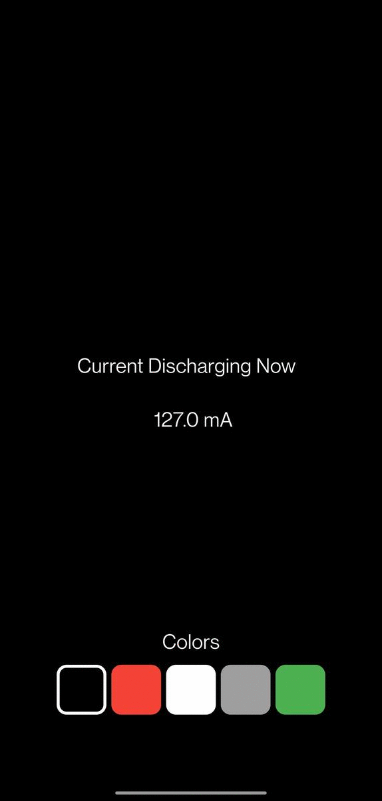

# 🔋🔋 Flutter App - Measure Battery Consumption

____
 

## Getting Started

 
This project, still in development, aims to make it possible to see how much energy a smartphone uses when displaying certain colors.

Many claim that using dark mode and dark colors will save battery power.

This application aims to verify this statement and see what other conclusions can be drawn about energy consumption.

 

_____

 

## Next Goals

 
- Create an automated test that checks the energy consumed over a period of time per color with different brightness levels